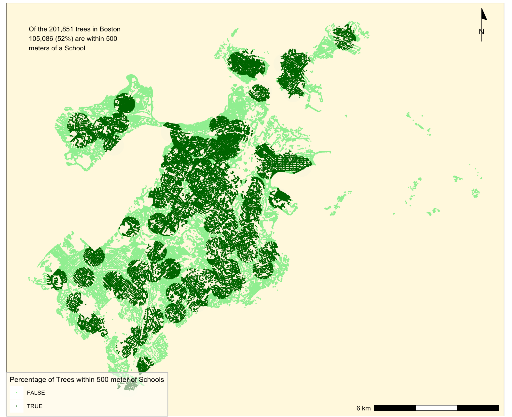
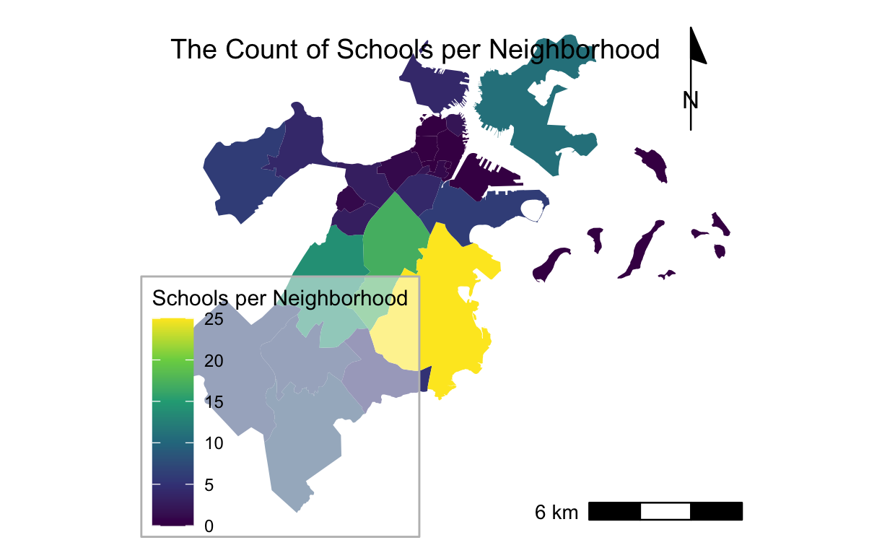

```{r setup, include=FALSE}
knitr::opts_chunk$set(echo = TRUE)
```
```{r}

```

# Maps of Boston
Here are two maps of Boston. I might include some text here about this set of maps.

## Interactive Map
This interactive map shows the percentage of households countywide with children as a proportion of the total count of households in Suffolk county. 
* demonstrates the following skills: Displaying data on an interactive map

[](web_resources/interactivemap_Suffolk_families_children.html){target="_blank"}

## Zonal Aggregation Map
###Map #1  shows the trees within 500 meters of schools across the city of Boston. It also notes the percentage of total trees within 500 meters of all school. 
* demonstrates the following skills: Calculating and displaying relationships among point and polygon layers based on distance
[](PDF/tree_cover_school.pdf){target="_blank"}

###Map #2 Boston Tree and Schools
Map#2 shows the count of schools per community area in Boston
*demonstrates aggregating points to a polygon
[](https://github.com/michaeljohnson8971/portfolio_examples/blob/main/images/school_concentration.png){target="_blank"}

## Accessibility
This map shows accessibility based on a distance-decay function of the walking time to the nearest transit stop. It demonstrates the following skills:

* Displaying multiple vector layers on the same map
* Calculating and displaying accessibility, based on travel time
* Displaying raster data on a map

[](https://cO_transit.pdf){target="_blank"}

## Maps of San Luis Obispo
Here are two maps of San Luis Obispo, California. I might include some text here as well.

## Isochrones
This map shows isochrones based on transit travel times to the nearest school. It demonstrates the following skills:

* Displaying multiple vector layers on the same map
* Calculating and displaying accessibility, based on travel time

[](https://c-x_schools.pdf){target="_blank"}


