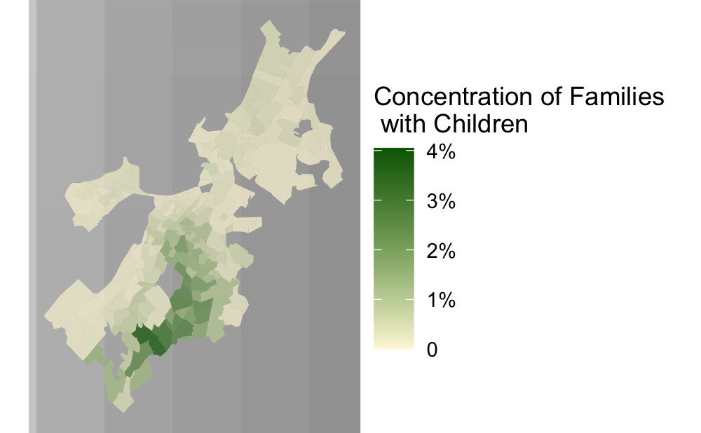

```{r setup, include=FALSE}
knitr::opts_chunk$set(echo = TRUE)
```
```{r}

```

# Maps of Boston
Here are two maps of Boston. I might include some text here about this set of maps.

## Interactive Map
This interactive map demonstrates the following skills: 

* Displaying data on an interactive map

[](https://michaeljohnson8971.github.io/portfolio_examples/web_resources/interactivemap_Suffolk_families_children.html){target="_blank"}

## Clockboard Map
This map demonstrates the following skills:

* Aggregating point data to a layer of polygons

[](https://c-voulgaris.github.io/portfolio_examples/fullsize/clockboard.pdf){target="_blank"}

# Maps of San Luis Obispo
Here are two maps of San Luis Obispo, California. I might include some text here as well.

## Isochrones
This map shows isochrones based on transit travel times to the nearest school. It demonstrates the following skills:

* Displaying multiple vector layers on the same map
* Calculating and displaying accessibility, based on travel time

[](https://c-x_schools.pdf){target="_blank"}

## Accessibility
This map shows accessibility based on a distance-decay function of the walking time to the nearest transit stop. It demonstrates the following skills:

* Displaying multiple vector layers on the same map
* Calculating and displaying accessibility, based on travel time
* Displaying raster data on a map

[](https://cO_transit.pdf){target="_blank"}
